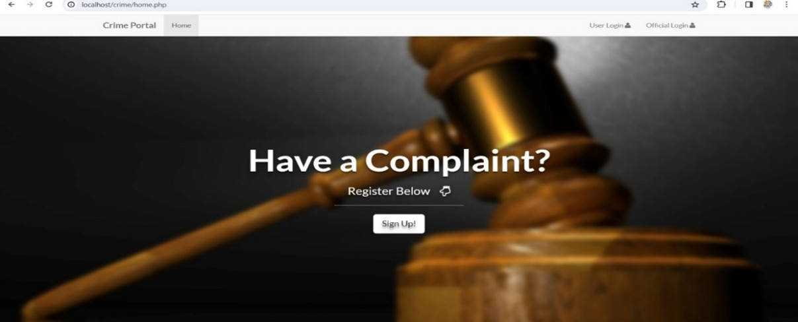
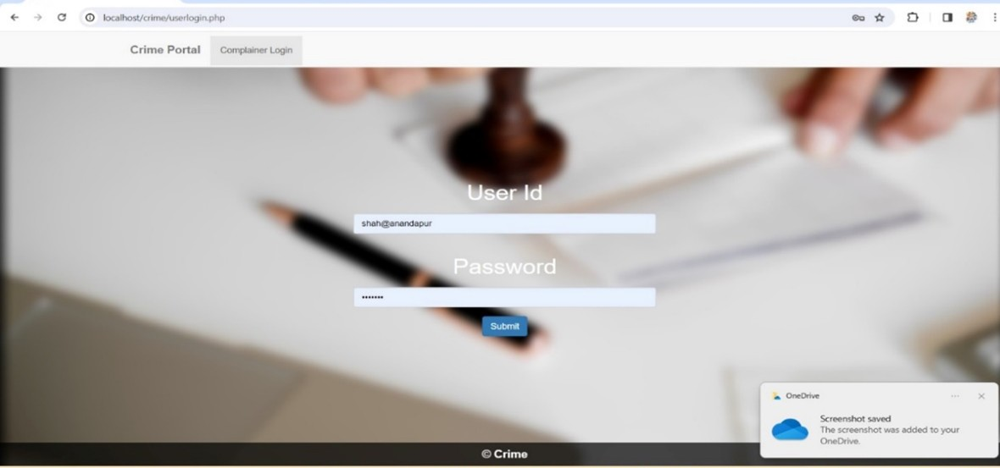
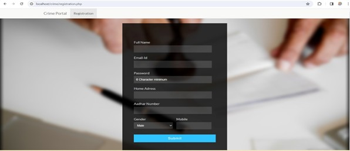
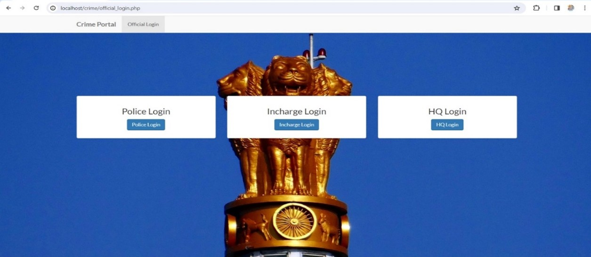
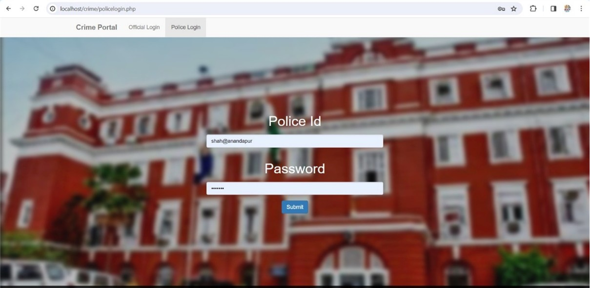

# Crime Record Management System

## Welcome
Welcome to the **Crime Record Management System** GitHub Repository! This repository hosts a comprehensive Database Management System (DBMS) project aimed at enhancing crime record management and analysis. Our project is designed to streamline the process of recording, organizing, and analyzing criminal activities, ensuring a more efficient and data-driven approach for law enforcement agencies.

## Key Features
### Admin
- Admin Dashboard
- View Staff List
- Assign cases to CID Officers
- Manage Account

### NCO
- NCO Dashboard
- Register a Complaint
- View list of complaints
- View details of case investigations
- Assign a case to a CID Officer
- Manage Account/Change Password

### CID
- CID Dashboard
- View list of assigned cases
- View details of case investigations
- Write a report on the case being investigated
- Manage Account/Change Password

## Technologies Used
Our project employs a robust tech stack including:
- **PHP**: Dynamic data processing
- **HTML & CSS**: User-friendly interface
- **JavaScript**: Enhanced interactivity and smooth user experience
- **MySQL**: Secure data storage and retrieval

## Efficient Data Management
With the integration of **MySQL**, our system ensures secure and structured storage of crime-related information. The relational database design facilitates seamless data manipulation, reporting, and analysis.

## Responsive Design
Our user interfaces are designed with responsiveness in mind, ensuring optimal performance across various devices and screen sizes.

## Screenshots
### Home Dashboard:

### Complaint Dashboard:

### CID Dashboard:

### NOC Dashboard:

### NOC Dashboard:

## System Requirements
### Hardware Requirements:
- Processor: Minimum 2GHz
- RAM: At least 1GB
- Hard Disk: Minimum 2GB free space

### Software Requirements:
- XAMPP/WAMP (Local Web Server)
- Web Browser (Chrome, Firefox, etc.)
- MySQL

## Installation & Setup
### Requirements
1. Download and install a local web server such as **XAMPP/WAMP**.
2. Download the provided source code zip file.

### Steps
1. **Start Apache & MySQL** in your XAMPP/WAMP Control Panel.
2. **Extract the source code** zip file.
3. **Copy the extracted folder** to:
   - `htdocs` directory (for XAMPP)
   - `www` directory (for WAMP)
4. **Open PHPMyAdmin** in a browser (`http://localhost/phpmyadmin`).
5. **Create a new database** named `bijapurpolice`.
6. **Import the provided SQL file** (`ghpolice.sql`) located inside the `DB File` folder.
7. **Run the system** by opening `http://localhost/bijapurpolice` in your browser.

## Default Credentials
### Admin
- `100 - djain123`
- `101 - agarwal123`

### NCO
- `113 - ajay123`
- `114 - usmani123`
- `117 - bijapur123`

### CID
- `115 - sukali123`
- `116 - attar123`
- `110 - shaikh123`

## Future Enhancements
- **Predictive Analytics**: Crime trend analysis using machine learning.
- **Real-time Data Integration**: Live data feeds from CCTV and social media.
- **Geospatial Mapping**: Visualization of crime hotspots on a map.
- **Mobile App Integration**: Extend system access via mobile applications.

## Contributing
If you would like to contribute:
- Fork the repository
- Create a feature branch (`git checkout -b feature-name`)
- Commit your changes (`git commit -m "Add feature"`)
- Push to the branch (`git push origin feature-name`)
- Open a pull request

## Contact
For queries or contributions, feel free to reach out to **Indu priya** at indureddyg1997@gmail.com.

